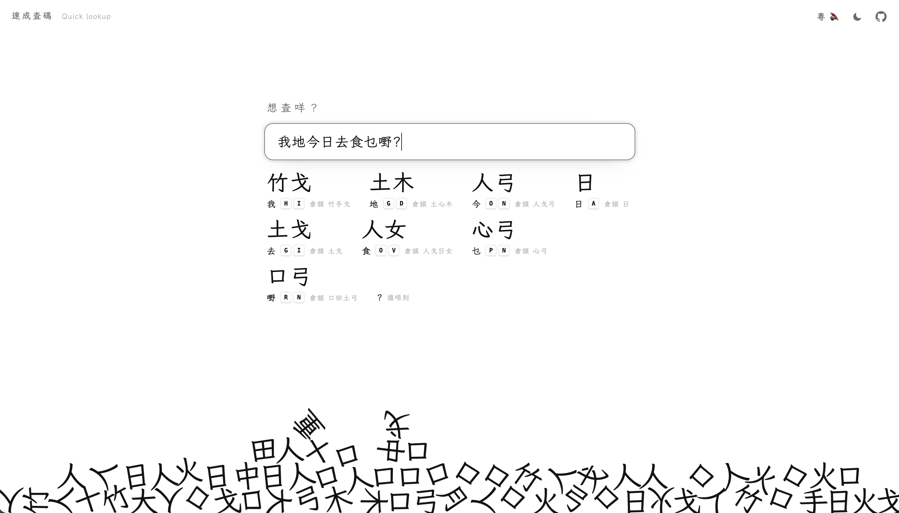
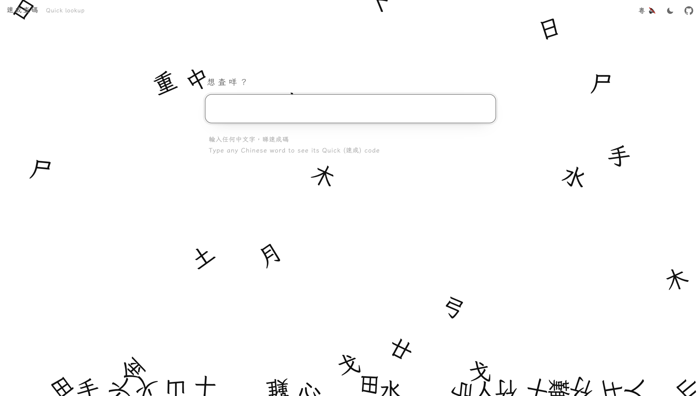

# 速成查碼 · Quick Lookup

Type any Chinese word and see how to type it in **速成 (Quick)**, the input method many people in Hong Kong grew up with. The Cangjie radicals for each character tumble out of a physics-driven pile and land beneath the search box.

<p align="center">
  <a href="https://www.carrielau.com/learn-quick-input/">
    
  </a>
  <br />
  <sub>No Chinese keyboard? Tap one of the example words to see it in action.</sub>
</p>

> 🚧 Work in progress: actively being built, so expect changes.




## Motivation

Learning to type and write Traditional Chinese characters is declining, as Pinyin input and Simplified characters dominate modern digital communication.

To me, a language and the way we type it are both important intangible cultural heritage. I wanted to create a piece of interactive media that helps preserve them, and at the same time a tool to train myself in typing Chinese characters.

Beyond heritage, a recent conversation with a friend reminded me how cool it is to speak and type in Cantonese again.

## Features

- Quick code lookup
- A living radical pile
- Light and dark mode

## How Quick (速成) works

速成 is a simplified form of 倉頡 (Cangjie). Every character has a Cangjie code of up to five radicals, and its Quick code is just the **first and last** of them:

| Character | Cangjie (倉頡) | Quick (速成) |
|---|---|---|
| 我 | 竹手戈 `HQI` | 竹戈 `HI` |
| 好 | 女弓木 `VND` | 女木 `VD` |
| 想 | 木山心 `DUP` | 木心 `DP` |

The codes follow **Cangjie 3**, the version used by the built-in Quick/Cangjie keyboards on macOS, Windows, iOS and Android.

## Run it locally

It's a plain static site, so any static server works:

```sh
python3 -m http.server 8741
```

Then open <http://127.0.0.1:8741/>.

## Credits

- **Cangjie 3 code table:** [Cangjie3-Plus 倉頡三代補完計畫](https://github.com/Arthurmcarthur/Cangjie3-Plus) (MIT License, © 朱邦復（發明）/倉頡之友·馬來西亞（修訂）/倉頡三代補完計劃（修訂）). The copyright notice is kept at the top of `cangjie.js`.
- **Physics:** [Matter.js](https://github.com/liabru/matter-js) (MIT License).
- **Fonts:** [LXGW WenKai TC 霞鶩文楷](https://github.com/lxgw/LxgwWenkaiTC) and [Noto Sans HK](https://fonts.google.com/noto/specimen/Noto+Sans+HK), both under the SIL Open Font License, served by Google Fonts.

## License

The code in this repository is released under the [MIT License](LICENSE). The Cangjie code data in `cangjie.js` keeps its own MIT license from Cangjie3-Plus.
